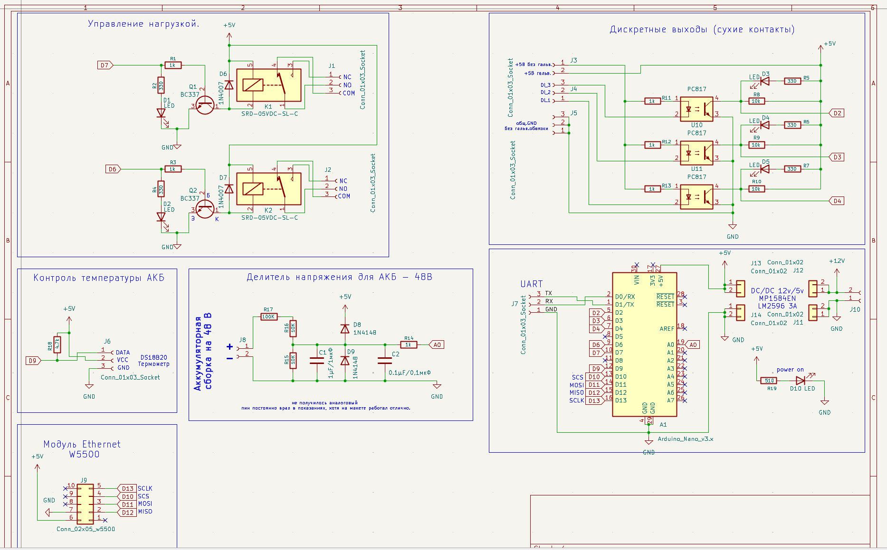

# PLC_PRS10

ПЛК ПРС-10 на Arduino + Ethernet. Использую для своих задач в Rapid SCADA: два реле, местный датчик DS18B20 и четыре дискретных входа.

Обмен — `Modbus TCP Slave`, библиотека [ModbusTCP_RU](https://github.com/UterGrooll/ModbusTCP_RU) `0.3.0`, Ethernet `W5100/W5500`.

## Возможности

- Управление двумя реле из SCADA.
- Автоматическое отключение первого реле через 60 секунд.
- Чтение температуры DS18B20 с точностью передачи 0,1 °C.
- Четыре дискретных входа с антидребезгом 50 мс.
- Восстановление Modbus-сервера после возврата Ethernet-линка W5500.

## Аппаратная часть

| Узел | Пин Arduino |
| --- | --- |
| Реле 1 | D7 |
| Реле 2 | D6 |
| DI1 | D2 |
| DI2 | D3 |
| DI3 | D4 |
| DI4 | D5 |
| DS18B20 | D9 |
| W5100/W5500 CS | D10 |

Реле включаются уровнем `HIGH`, при запуске оба выключены (`LOW`). Входы работают через `INPUT_PULLUP`: замкнутый на GND контакт — активный вход.

Ethernet использует стандартные пины SPI платы.

## Сеть

| Параметр | Значение |
| --- | --- |
| IP | `192.168.1.179` |
| MAC | `02:47:A1:10:00:02` |
| Шлюз / DNS | `192.168.1.1` |
| Маска | `255.255.255.0` |
| Порт Modbus TCP | `502` |

Для проверки нужен доступ к сети `192.168.1.0/24`. При необходимости сетевые параметры меняются в начале скетча. MAC и IP не должны совпадать с другим устройством в сети.

## Карта Modbus

Адреса в таблице начинаются с нуля. Coils, Discrete Inputs и Input Registers — отдельные области памяти.

| Область | FC | Address | Назначение |
| --- | --- | --- | --- |
| Coil | 01 / 05 / 15 | 0 | Реле 1, D7; авто-отключение через 60 с |
| Coil | 01 / 05 / 15 | 1 | Реле 2, D6 |
| Discrete Input | 02 | 0 | DI1, D2 |
| Discrete Input | 02 | 1 | DI2, D3 |
| Discrete Input | 02 | 2 | DI3, D4 |
| Discrete Input | 02 | 3 | DI4, D5 |
| Input Register | 04 | 0 | Местная температура DS18B20, °C × 10 |

Для реле: `0 = OFF`, `1 = ON`. Повторная команда ON не продлевает таймер реле 1; для нового цикла нужны OFF → ON. Время задаётся константой `RELAY1_TIMEOUT` в скетче. Настройки времени через Holding Registers здесь нет.

Для входов: `1 = замкнут / LOW`, `0 = разомкнут / HIGH`.

Температура передаётся как **Signed 16-bit**: `253 = 25,3 °C`, `-55 = -5,5 °C`. Значение `32767` означает ошибку или отсутствие измерения; его нельзя пересчитывать в температуру.

## Настройка Modbus Poll

Connection → Connect:

| Параметр | Значение |
| --- | --- |
| Connection | Modbus TCP/IP |
| IP | `192.168.1.179` |
| Server Port | `502` |
| Slave ID | `1` |
| Response Timeout | `1000 ms` |

Read/Write Definition:

| Что читать | Function | Address | Quantity |
| --- | --- | --- | --- |
| Реле | 01 Read Coils | 0 | 2 |
| Входы | 02 Read Discrete Inputs | 0 | 4 |
| Температура | 04 Read Input Registers | 0 | 1 |

Scan Rate для начала — `1000 ms`. При вводе этих адресов отключить `PLC Addresses (Base 1)`.

Запись реле выполняется через `05 Write Single Coil`: Address `0` для первого реле или `1` для второго, Value `ON/OFF`. Команду записи отправлять однократно.

Для температуры выбрать Signed 16-bit и делить значение на 10 в SCADA.

## Восстановление Ethernet

При старте вызываются `Ethernet.begin(mac, ip, dnsServer, gateway, subnet)` и `mb.begin()`.

После пропадания и устойчивого возврата `LinkON` на W5500 выдерживается не менее 1,5 с, затем `mb.restart()` закрывает старые клиентские соединения. Повторного `Ethernet.begin()` и блокирующей паузы в этом обработчике нет. SCADA или Modbus Poll должны подключиться заново.

W5100 может возвращать `Unknown` в `linkStatus()`. Это не вызывает периодического сброса Ethernet.

Это контроль Ethernet-соединения, **не аппаратный watchdog AVR**. Аппаратный watchdog в этом скетче не включён.

## Прошивка

Актуальный скетч: [firmware/plc_prs10/plc_prs10.ino](firmware/plc_prs10/plc_prs10.ino).

Зависимости:

- `SPI` — входит в Arduino core.
- `Ethernet 2.0.2`.
- [ModbusTCP_RU 0.3.0](https://github.com/UterGrooll/ModbusTCP_RU).
- `GyverDS18`.

Размеры памяти Modbus задаются в общем файле библиотеки `src/ModbusTCP_RU_config.h`, а не через локальные `#define` в скетче.

Скетч собран для Arduino UNO и Nano ATmega328P Old Bootloader: `16820` байт Flash, `771` байт SRAM. Проверка сборки не заменяет испытания этой версии на плате.

После заливки проверить реле, четыре входа, температуру, авто-отключение реле 1 и переподключение после возврата кабеля. Реле проверять на безопасной нагрузке.

## Материалы

- [schematic/](schematic/) — исходники схемы.
- [case/](case/) — модель корпуса.
- [screenshot/](screenshot/) — фотографии и изображения.
- [src/](src/) — предыдущие скетчи; для текущей заливки используется только `firmware/plc_prs10/`.

---

by UterGrooll
2026
